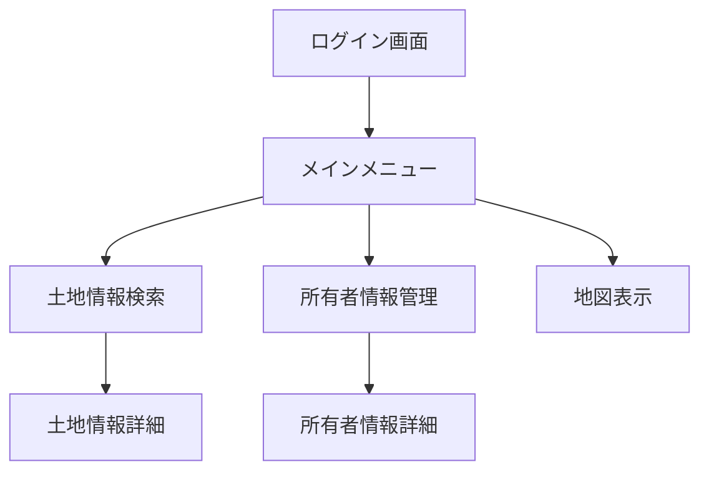
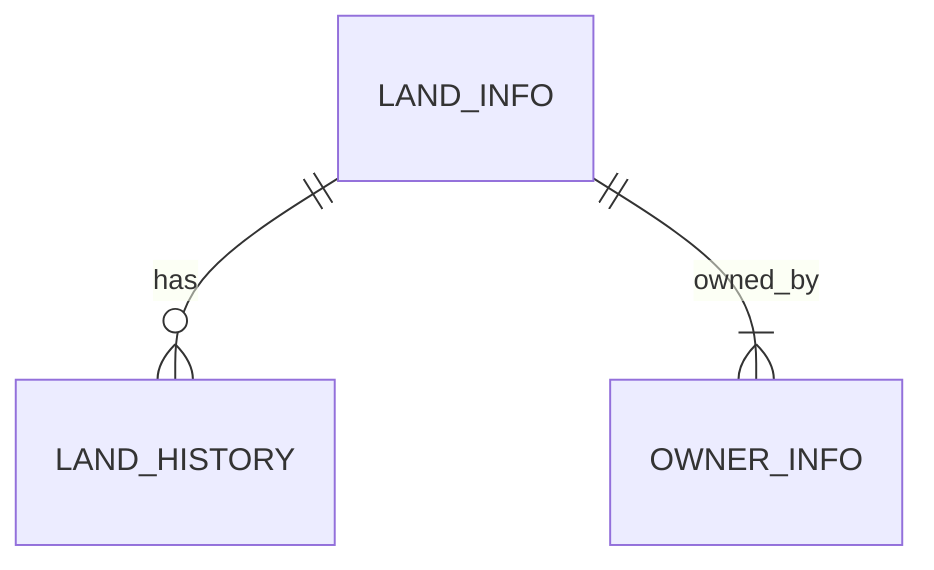
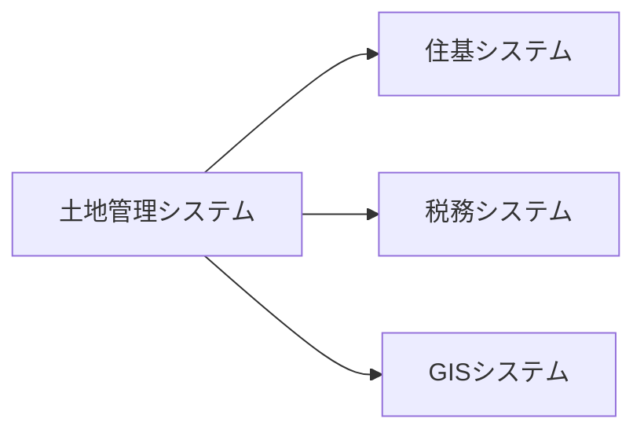

# 基本設計書

## 文書管理情報

| 項目 | 内容 |
|------|------|
| 文書名 | 土地管理システム基本設計書 |
| 文書番号 | BD-001 |
| 版数 | 1.0 |
| 作成日 | YYYY/MM/DD |
| 最終更新日 | YYYY/MM/DD |
| 作成者 | 〇〇 〇〇 |
| 承認者 | □□ □□ |

## 1. システムアーキテクチャ設計

### 1.1 システム構成図
```
[クライアント層]
    ↓ HTTPS
[Webサーバー層]
    ↓ TCP/IP
[アプリケーション層]
    ↓ TCP/IP
[データベース層]
```

### 1.2 使用技術
- フロントエンド
  - Framework: React
  - UI Library: Material-UI
  - Map: Leaflet
  
- バックエンド
  - Language: Java
  - Framework: Spring Boot
  - ORM: MyBatis
  
- データベース
  - RDBMS: PostgreSQL
  - GIS拡張: PostGIS

## 2. 機能設計

### 2.1 画面遷移図


### 2.2 コンポーネント構成
- 共通コンポーネント
  - ヘッダー
  - メニュー
  - 検索条件
  - 一覧表示
  - 地図表示

- 業務コンポーネント
  - 土地情報管理
  - 所有者情報管理
  - 証明書発行

## 3. データベース設計

### 3.1 テーブル一覧

| テーブル名 | 説明 | 予想レコード数 |
|------------|------|----------------|
| LAND_INFO | 土地基本情報 | 100万件 |
| OWNER_INFO | 所有者情報 | 10万件 |
| LAND_HISTORY | 土地異動履歴 | 500万件 |

### 3.2 ER図


## 4. セキュリティ設計

### 4.1 認証方式
- SSO連携
- セッション管理
- パスワードポリシー

### 4.2 認可設計
| ロール | 説明 | 権限 |
|--------|------|------|
| システム管理者 | システム全体の管理 | 全機能 |
| 一般ユーザー | 通常の業務処理 | 参照・更新 |
| 照会ユーザー | 情報照会のみ | 参照のみ |

### 4.3 セキュリティ対策
- 通信暗号化（TLS1.3）
- データ暗号化
- ログ管理
- 不正アクセス対策

## 5. 性能設計

### 5.1 リソース設計
- CPU: 8コア
- メモリ: 32GB
- ストレージ: 2TB

### 5.2 性能目標値
| 処理内容 | 目標値 | 測定条件 |
|----------|---------|----------|
| 画面表示 | 3秒以内 | 通常時 |
| 一覧検索 | 5秒以内 | 1000件以内 |
| 帳票出力 | 10秒以内 | A4 10ページ以内 |

## 6. 外部インターフェース設計

### 6.1 外部システム連携図


### 6.2 インターフェース仕様
| システム名 | 連携方式 | データ形式 | 連携タイミング |
|------------|----------|------------|----------------|
| 住基システム | REST API | JSON | リアルタイム |
| 税務システム | ファイル | CSV | 日次バッチ |
| GISシステム | REST API | GeoJSON | リアルタイム |

## 7. 運用設計

### 7.1 バックアップ設計
- データベース：日次フルバックアップ
- ログファイル：月次アーカイブ
- 設定ファイル：変更時

### 7.2 監視設計
- リソース監視
- プロセス監視
- ログ監視
- 死活監視