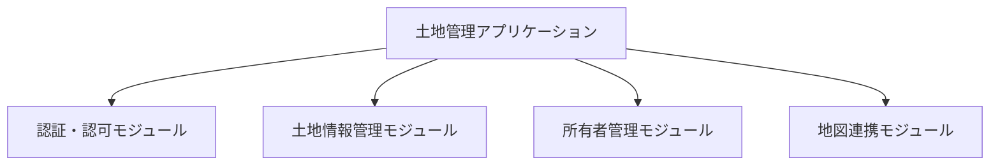
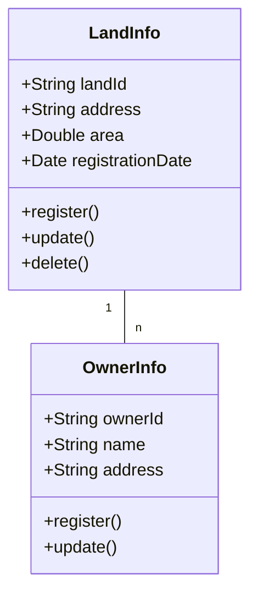

# 詳細設計書

## 文書管理情報

| 項目 | 内容 |
|------|------|
| 文書名 | 土地管理システム詳細設計書 |
| 文書番号 | DD-001 |
| 版数 | 1.0 |
| 作成日 | YYYY/MM/DD |
| 最終更新日 | YYYY/MM/DD |
| 作成者 | 〇〇 〇〇 |
| 承認者 | □□ □□ |

## 1. モジュール設計

### 1.1 モジュール構成


### 1.2 モジュール一覧
| モジュールID | モジュール名 | 概要 | 依存モジュール |
|--------------|--------------|------|----------------|
| M001 | 認証モジュール | ユーザー認証処理 | なし |
| M002 | 土地情報管理 | 土地情報のCRUD | M001 |

## 2. クラス設計

### 2.1 クラス図


### 2.2 クラス詳細
#### LandInfo クラス
| 項目 | 内容 |
|------|------|
| クラス名 | LandInfo |
| 概要 | 土地情報を管理するクラス |
| 責務 | 土地情報のCRUD操作 |

##### メソッド一覧
| メソッド名 | 引数 | 戻り値 | 処理概要 |
|------------|------|--------|----------|
| register | LandDTO | boolean | 土地情報登録 |
| update | LandDTO | boolean | 土地情報更新 |

## 3. 画面詳細設計

### 3.1 土地情報検索画面
#### 画面レイアウト
```
+------------------------+
|  検索条件             |
|  ＿＿＿＿＿＿＿＿    |
| |地番           |    |
| +---------------+    |
|  検索ボタン          |
+------------------------+
```

#### 項目定義
| 項目ID | 項目名 | 種類 | 桁数 | 入力制御 |
|--------|--------|------|------|----------|
| F001 | 地番 | テキスト | 20 | 半