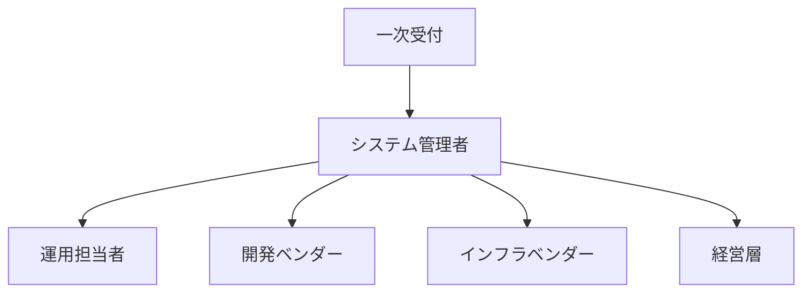
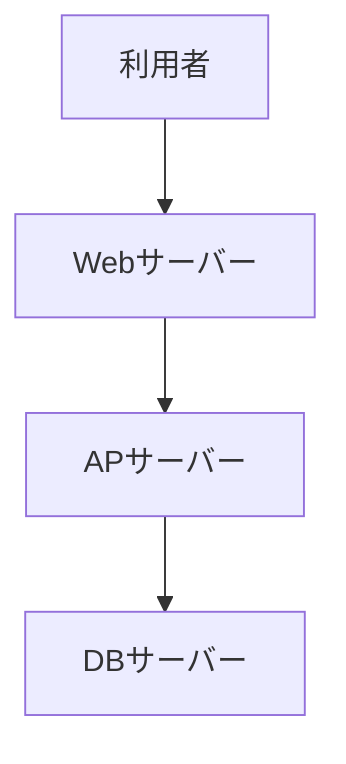

# 障害対応手順書

## 文書管理情報

| 項目 | 内容 |
|------|------|
| 文書名 | 土地管理システム障害対応手順書 |
| 文書番号 | INC-001 |
| 版数 | 1.0 |
| 作成日 | YYYY/MM/DD |
| 最終更新日 | YYYY/MM/DD |
| 作成者 | 〇〇 〇〇 |
| 承認者 | □□ □□ |

## 1. 障害対応体制

### 1.1 緊急連絡体制


### 1.2 役割と責任
| 役割 | 担当者 | 連絡先 | 責任範囲 |
|------|--------|--------|----------|
| システム管理者 | 〇〇 〇〇 | xxx-xxxx | 障害対応統括 |
| 運用担当者 | △△ △△ | xxx-xxxx | 一次対応 |
| 開発ベンダー | □□ □□ | xxx-xxxx | プログラム障害対応 |

## 2. 障害レベル定義

### 2.1 障害レベル分類
| レベル | 定義 | 影響範囲 | 対応時間 | 報告基準 |
|--------|------|----------|----------|----------|
| レベル1（重大） | システム停止 | 全利用者 | 即時（30分以内） | 経営層まで |
| レベル2（重要） | 主要機能停止 | 特定業務 | 2時間以内 | 部長まで |
| レベル3（軽微） | 一部機能不具合 | 限定的 | 24時間以内 | 課長まで |

### 2.2 初動対応基準
| レベル | 一次対応 | エスカレーション | 報告方法 |
|--------|----------|------------------|----------|
| レベル1 | 即時対応 | 30分以内 | 電話・メール |
| レベル2 | 2時間以内 | 4時間以内 | メール |
| レベル3 | 24時間以内 | 必要に応じて | メール |

## 3. 障害検知・報告

### 3.1 障害検知方法
1. システム監視アラート
   - CPU使用率
   - メモリ使用率
   - ディスク使用率
   - プロセス状態
   
2. ログ監視
   - エラーログ
   - アクセスログ
   - セキュリティログ

3. ユーザー報告
   - ヘルプデスク
   - 電話・メール

### 3.2 報告フロー
1. 障害検知
2. システム管理者へ第一報
3. 影響範囲の特定
4. 障害レベルの判定
5. 関係者への報告

## 4. 障害対応手順

### 4.1 初動対応
1. 障害状況の把握
   - 発生時刻
   - 影響範囲
   - 再現性
   
2. 一時対応の実施
   - プロセス再起動
   - サービス再起動
   - システム再起動

3. ログの保全
   - エラーログ
   - アプリケーションログ
   - システムログ

### 4.2 障害切り分け
1. システム構成の確認
   - ネットワーク状態
   - サーバー状態
   - プロセス状態
   
2. エラー内容の分析
   - ログ解析
   - エラーコード確認
   - 過去事例との照合

### 4.3 復旧手順
1. システム停止時
   ```
   1. 利用者への通知
   2. プロセス終了確認
   3. サービス再起動
   4. 動作確認
   ```

2. データベース障害時
   ```
   1. バックアップ確認
   2. リストア実施
   3. 整合性チェック
   4. 動作確認
   ```

## 5. 事後対応

### 5.1 報告書作成
1. 障害報告書
   - 発生日時
   - 障害内容
   - 影響範囲
   - 対応内容
   - 原因分析
   - 再発防止策

2. 再発防止策の実施
   - 手順書の見直し
   - 監視項目の追加
   - システム改修

### 5.2 定期レビュー
1. 月次レビュー
   - 障害統計
   - 対応時間分析
   - 課題抽出

2. 四半期レビュー
   - 再発防止策の評価
   - 手順書の見直し
   - 教育訓練の計画

## 6. 付録

### 6.1 システム構成図


### 6.2 復旧手順書一覧
1. システム再起動手順書
2. DBリカバリ手順書
3. ネットワーク復旧手順書

### 6.3 チェックリスト
- 初動対応チェックリスト
- 障害報告チェックリスト
- 復旧確認チェックリスト