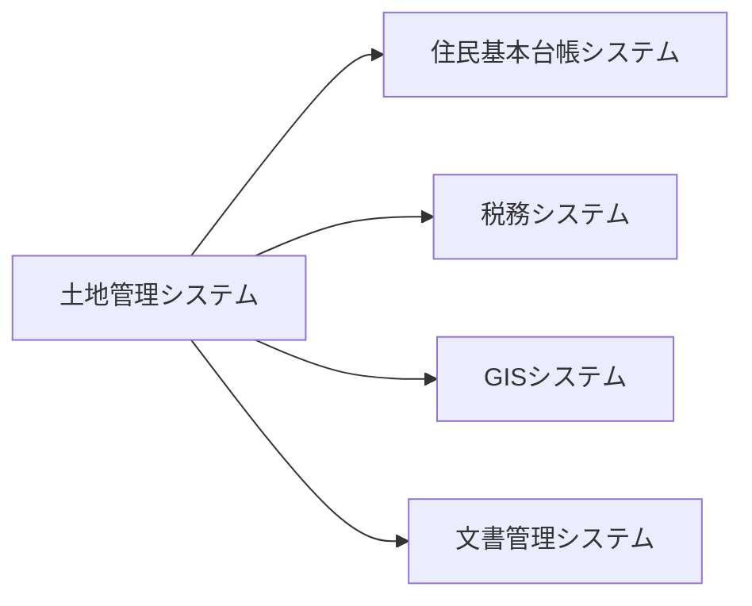

# 外部インターフェース設計書

## 文書管理情報

| 項目 | 内容 |
|------|------|
| 文書名 | 土地管理システム外部インターフェース設計書 |
| 文書番号 | IF-001 |
| 版数 | 1.0 |
| 作成日 | YYYY/MM/DD |
| 最終更新日 | YYYY/MM/DD |
| 作成者 | 〇〇 〇〇 |
| 承認者 | □□ □□ |

## 1. インターフェース概要

### 1.1 システム間連携図

### 1.2 インターフェース一覧
| IF-ID | インターフェース名 | 連携システム | 連携方式 | データ形式 |
|-------|-------------------|--------------|----------|------------|
| IF001 | 住民情報連携 | 住基システム | API | JSON |
| IF002 | 課税情報連携