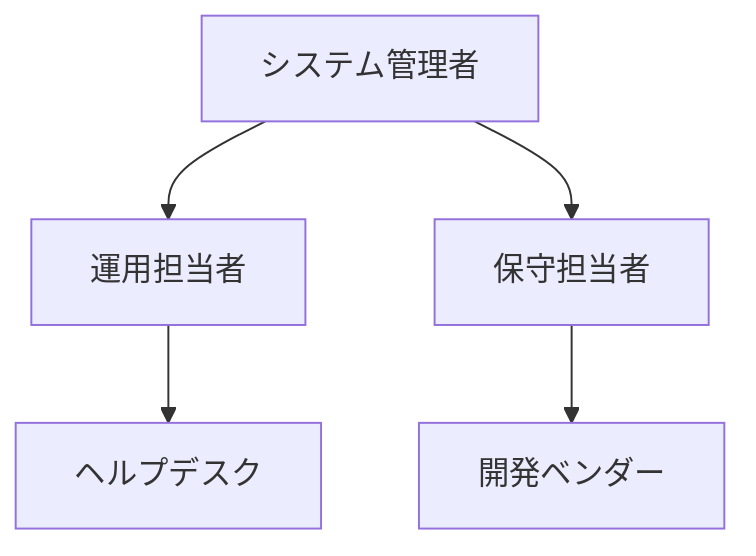

# システム運用手順書

## 文書管理情報

| 項目 | 内容 |
|------|------|
| 文書名 | 土地管理システム運用手順書 |
| 文書番号 | OPE-001 |
| 版数 | 1.0 |
| 作成日 | YYYY/MM/DD |
| 最終更新日 | YYYY/MM/DD |
| 作成者 | 〇〇 〇〇 |
| 承認者 | □□ □□ |

## 1. システム運用体制

### 1.1 運用体制図

### 1.2 役割と責任
| 役割 | 責任者 | 主な責任 | 連絡先 |
|------|--------|----------|--------|
| システム管理者 | 〇〇 〇〇 | システム全体の管理統括 | xxx-xxxx |
| 運用担当者 | △△ △△ | 日常運用管理 | xxx-xxxx |

## 2. 日常運用手順

### 2.1 起動・停止手順
1. システム起動手順
   - アプリケーションサーバー起動
   - データベース起動
   - サービス起動確認

2. システム停止手順
   - 利用者への通知
   - セッション終了確認
   - サービス停止
   
### 2.2 バックアップ手順
1. 日次バックアップ
   - 実行タイミング：毎日深夜1:00
   - 対象：データベース全体
   - 保存期間：1週間

2. 週次バックアップ
   - 実行タイミング：毎週日曜日
   - 対象：システム全体
   - 保存期間：1ヶ月

### 2.3 監視手順
1. システム監視
   - CPU使用率
   - メモリ使用率
   - ディスク使用率
   - プロセス状態

2. ログ監視
   - アプリケーションログ
   - データベースログ
   - セキュリティログ

## 3. 定期運用手順

### 3.1 月次処理
1. パフォーマンス分析
2. キャパシティ管理
3. セキュリティパッチ適用

### 3.2 四半期処理
1. システム統計レポート作成
2. 性能分析レポート作成
3. セキュリティ監査

## 4. 障害対応手順

### 4.1 障害レベル定義
| レベル | 内容 | 初期対応時間 | 報告先 |
|--------|------|--------------|--------|
| 重大 | システム停止 | 30分以内 | 経営層まで |
| 軽微 | 一部機能障害 | 2時間以内 | 管理者まで |

### 4.2 一次対応手順
1. 障害の切り分け
2. 影響範囲の特定
3. 応急対応
4. 報告・エスカレーション

### 4.3 復旧手順
1. バックアップからのリストア手順
2. データベース復旧手順
3. サービス再開手順

## 5. セキュリティ運用手順

### 5.1 アカウント管理
1. アカウント作成手順
2. 権限設定手順
3. アカウント棚卸手順

### 5.2 セキュリティ監視
1. 不正アクセス監視
2. マルウェア対策
3. セキュリティログ分析

## 6. 報告書作成手順

### 6.1 日次報告
1. システム稼働状況
2. 障害・インシデント状況
3. 性能統計情報

### 6.2 月次報告
1. SLA達成状況
2. システムリソース使用状況
3. セキュリティインシデント状況