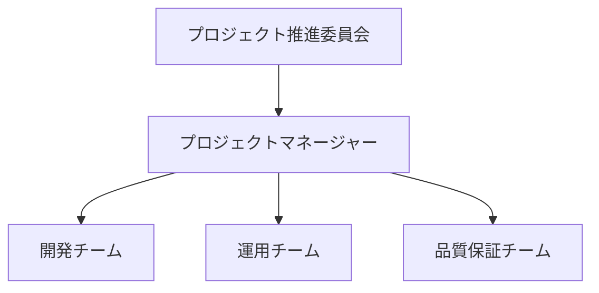
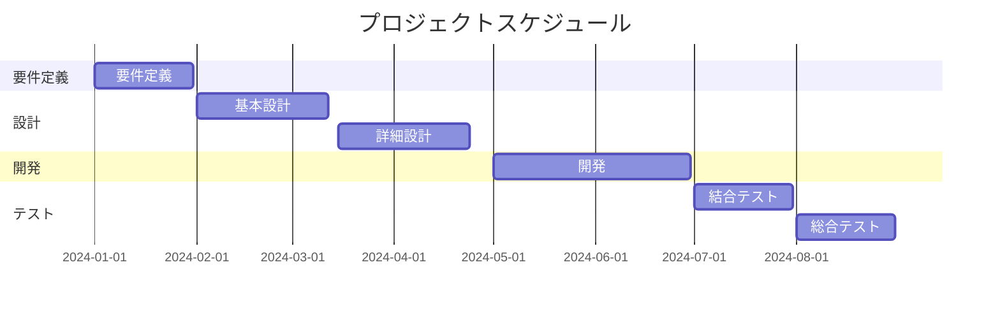

# プロジェクト計画書

## 文書管理情報

| 項目 | 内容 |
|------|------|
| 文書名 | 土地管理システム構築プロジェクト計画書 |
| 文書番号 | PRJ-001 |
| 版数 | 1.0 |
| 作成日 | YYYY/MM/DD |
| 最終更新日 | YYYY/MM/DD |
| 作成者 | 〇〇 〇〇 |
| 承認者 | □□ □□ |

## 1. プロジェクト概要

### 1.1 目的
本プロジェクトは、自治体における土地管理業務の効率化と正確性向上を目的とし、新たな土地管理システムを構築する。

### 1.2 目標
1. 業務効率化：処理時間30%削減
2. 正確性向上：入力ミス80%削減
3. 住民サービス向上：窓口待ち時間50%削減

### 1.3 成功基準
- 予算内での完遂
- スケジュール通りの納品
- 品質目標の達成
- ユーザー満足度80%以上

## 2. プロジェクト体制

### 2.1 体制図

### 2.2 役割分担
| 役割 | 氏名 | 所属 | 責任範囲 |
|------|------|------|----------|
| PM | 〇〇 〇〇 | IT推進部 | プロジェクト全体統括 |
| 開発リーダー | △△ △△ | 開発ベンダー | 開発チーム統括 |

## 3. スケジュール

### 3.1 全体スケジュール

### 3.2 マイルストーン
| マイルストーン | 予定日 | 成果物 |
|----------------|--------|--------|
| 要件定義完了 | YYYY/MM/DD | 要件定義書 |
| 基本設計完了 | YYYY/MM/DD | 基本設計書 |
| 開発完了 | YYYY/MM/DD | プログラム一式 |

## 4. 予算計画

### 4.1 予算概要
| 項目 | 金額（千円） | 備考 |
|------|-------------|------|
| 人件費 | XX,XXX | 開発要員 |
| 機器費 | XX,XXX | サーバー、PC |
| ライセンス費 | X,XXX | ソフトウェア |

### 4.2 支払いスケジュール
| 時期 | 金額（千円） | マイルストーン |
|------|-------------|----------------|
| 契約時 | XX,XXX | 契約締結 |
| 中間 | XX,XXX | 基本設計完了時 |

## 5. リスク管理

### 5.1 リスク一覧
| リスクID | リスク内容 | 影響度 | 発生確率 | 対策 |
|----------|------------|--------|-----------|------|
| R001 | 要員確保難 | 高 | 中 | 早期採用活動 |
| R002 | 要件変更多発 | 高 | 高 | 変更管理の徹底 |

### 5.2 リスク対応計画
1. 定期的なリスク評価
2. 対策の実施状況確認
3. 新規リスクの識別

## 6. 品質管理

### 6.1 品質目標
1. 重大障害：0件
2. 開発生産性：XX人時/FP
3. バグ密度：X個/KLOC以下

### 6.2 品質保証方法
1. レビュー実施
2. テストの充実
3. 第三者検証

## 7. コミュニケーション計画

### 7.1 会議体制
| 会議名 | 頻度 | 参加者 | 目的 |
|--------|------|--------|------|
| 進捗会議 | 週次 | PM、各リーダー | 進捗確認 |
| 課題会議 | 週次 | 開発チーム | 課題解決 |

### 7.2 報告体制
1. 日次報告：進捗状況
2. 週次報告：課題・リスク
3. 月次報告：品質・コスト