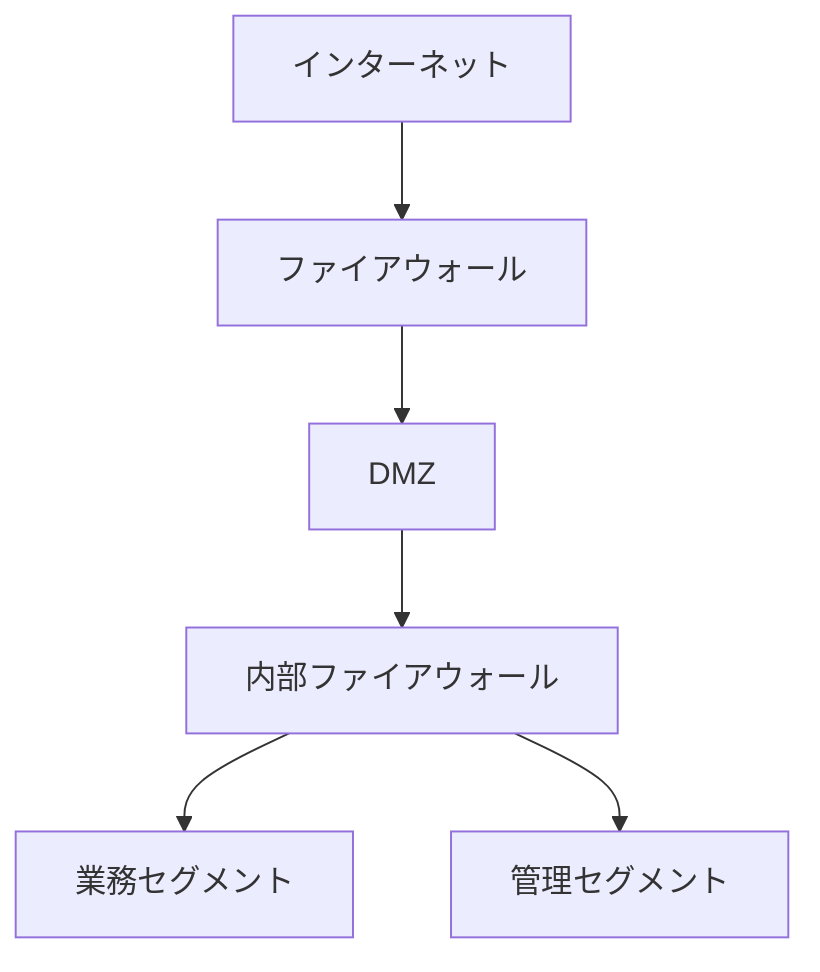

# セキュリティ設計書

## 文書管理情報

| 項目 | 内容 |
|------|------|
| 文書名 | 土地管理システムセキュリティ設計書 |
| 文書番号 | SEC-001 |
| 版数 | 1.0 |
| 作成日 | YYYY/MM/DD |
| 最終更新日 | YYYY/MM/DD |
| 作成者 | 〇〇 〇〇 |
| 承認者 | □□ □□ |

## 1. セキュリティ要件

### 1.1 セキュリティ基本方針
1. 機密性の確保
   - 個人情報の保護
   - アクセス制御の徹底
   - データの暗号化

2. 完全性の確保
   - データの正確性維持
   - 改ざん防止
   - 監査証跡の記録

3. 可用性の確保
   - システムの安定稼働
   - バックアップ・リカバリ
   - 災害対策

### 1.2 適用範囲
- アプリケーション
- データベース
- ネットワーク
- 運用・保守

## 2. アクセス制御設計

### 2.1 認証設計
1. 認証方式
   - ID/パスワード認証
   - 多要素認証（必要に応じて）
   - シングルサインオン連携

2. パスワードポリシー
   - 最低8文字以上
   - 英数字記号混在
   - 90日ごとの変更要求
   - 過去5世代までの再利用禁止

### 2.2 認可設計
| ロール | 権限 | 対象機能 |
|--------|------|----------|
| システム管理者 | 全権限 | 全機能 |
| 業務管理者 | 参照・更新 | 業務機能 |
| 一般ユーザー | 参照のみ | 限定機能 |

### 2.3 セッション管理
- セッションタイムアウト：30分
- 同時ログイン制限：1セッション
- セッションID管理
- CSRF対策

## 3. データ保護設計

### 3.1 暗号化設計
1. 保存データ暗号化
   - 個人情報
   - 認証情報
   - 重要データ

2. 通信経路暗号化
   - TLS 1.3使用
   - 証明書管理
   - 暗号スイート設定

### 3.2 データアクセス制御
| データ分類 | アクセス制御方式 | バックアップ頻度 |
|------------|------------------|------------------|
| 機密データ | 暗号化・アクセスログ | 日次 |
| 一般データ | アクセスログ | 週次 |

## 4. ネットワークセキュリティ設計

### 4.1 ネットワーク構成

### 4.2 通信制御設計
| 通信元 | 通信先 | プロトコル | ポート | 用途 |
|--------|--------|------------|---------|------|
| 利用者PC | Webサーバー | HTTPS | 443 | Web接続 |
| 運用端末 | DBサーバー | TCP | 5432 | DB管理 |

## 5. 監視・監査設計

### 5.1 ログ管理
1. 取得するログ
   - アプリケーションログ
   - セキュリティログ
   - システムログ
   - 操作ログ

2. ログ保管
   - 保管期間：5年
   - 暗号化保存
   - アクセス制御

### 5.2 監視項目
| 監視対象 | 監視項目 | 閾値 | アラート |
|----------|----------|------|----------|
| 不正アクセス | ログイン失敗 | 5回/10分 | 即時通知 |
| リソース | CPU使用率 | 80%以上 | 警告通知 |

## 6. インシデント対応

### 6.1 インシデント分類
| レベル | 内容 | 対応時間 | 報告先 |
|--------|------|----------|--------|
| 重大 | 情報漏洩 | 即時 | 経営層 |
| 警告 | 不正アクセス試行 | 2時間以内 | 管理者 |

### 6.2 対応手順
1. 検知・通知
2. 一次対応
3. 影響調査
4. 原因究明
5. 復旧・再発防止

## 7. セキュリティ運用

### 7.1 定期点検
1. 脆弱性診断（年2回）
2. セキュリティパッチ適用
3. アクセス権限棚卸し
4. パスワード変更管理

### 7.2 教育・訓練
1. セキュリティ教育（年1回）
2. インシデント対応訓練
3. 手順書見直し